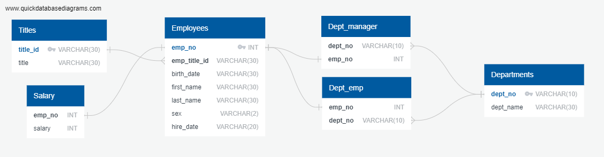

## sql-challenge
#### Employee File Research Project dealing with multiple data sources in SQL.
##### Compiling emplpyee personal data, salaries, titles, and information regarding the department structure of the company.
## ERD

## Analysis 
### Joins of these tables were useful in selecting data for employee salary, titles, manager, and specific department. Queries were performed for specific cases including all employees hired in 1986 or those with the first name Hercules. It also allowed us to determine the most common last names in the company (Baba, Gelosh, and Coorg). 

### Resources:
##### Split String in SQL: https://w3resource.com/PostgreSQL/split_part-function.php 
